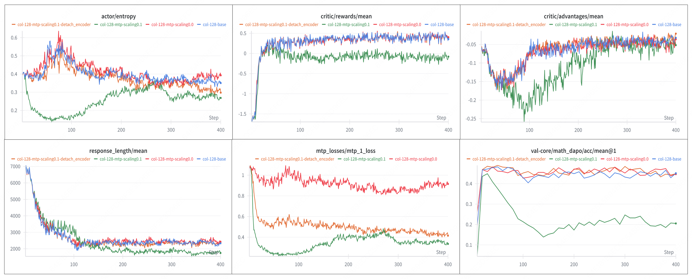
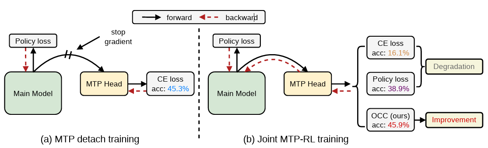

# Joint Training of Multi-Token Prediction in Reinforcement Learning via Optimal Coefficient Calibration

&nbsp;

This is the official implementation of the paper [Joint Training of Multi-Token Prediction in Reinforcement Learning via Optimal Coefficient Calibration](https://arxiv.org/abs/2605.28184).

## What happend to MTP in RL

Reinforcement Learning from Verifiable Rewards (RLVR) has become a standard recipe for improving the reasoning capability of large language models, while Multi-Token Prediction (MTP) is widely used during pretraining. Combining them is natural, but in current RL practice MTP gradients are often detached because direct joint training can degrade performance. This phenomenon can also be found in the verl MTP guide: [Guide to Using MTP in SFT/RL Training and Inference](https://verl.readthedocs.io/en/latest/advance/mtp.html).

The MiMo-7B traces below illustrate the degradation that motivates our analysis. We revisit this failure from an optimization perspective and show that the per-step effect of MTP on the RL objective can be decomposed into a first-order correlation term and a second-order perturbation penalty.

## Method Overview

The main figure summarizes our transition from detached MTP training to joint MTP-RL training. The decomposition unifies three MTP training regimes: Detach, Cross-Entropy loss, and Policy loss, explaining why each succeeds or fails. Although policy loss aligns better with the RL objective, its correlation term can decay while the quadratic penalty persists. Guided by this analysis, Optimal Coefficient Calibration (OCC) adaptively tracks the coefficient online through a log-probability proxy, so that the MTP update supports the RL objective instead of perturbing it.

## Status

- verl PR: work in progress.
- slime PR: work in progress.
- The slime integration is under active development. It is intended to bring the same MTP-RL training workflow to the slime stack, including RL-style MTP loss support and runnable training scripts. Please contact me if you are interested in collaborating.

## Main Changes in `verl`

This project extends `verl` with experimental support for joint RL training of Multi-Token Prediction (MTP) modules.

The main changes are concentrated in the Megatron/MCore training path:

For instructions on using MTP in verl, please refer to the official verl documentation: [Guide to Using MTP in SFT/RL Training and Inference](https://verl.readthedocs.io/en/latest/advance/mtp.html).

- `actor_rollout_ref.model.mtp.mtp_loss_type`
  - `ce` keeps the original Megatron MTP loss, namely the token-level cross-entropy loss from the MTP heads.
  - `rl` enables the added RL loss path, where MTP heads compute the same policy-gradient style loss as the main model head.
  - `actor_rollout_ref.model.mtp.mtp_loss_scaling_factor` controls the coefficient of the MTP loss term.

- `verl/models/mcore/mtp_patch.py`
  - `MTPRLOutput` stores the per-head MTP log probabilities that are later consumed by the actor loss.
  - `_megatron_gptmodel_postprocess_rl` is the RL-specific postprocess path. It runs the MTP heads, converts their token-level cross-entropy outputs into log probabilities, and stores the aligned results in `MTPRLOutput`.
  - `_roll_tensor_packed_seq_right` right-shifts MTP log probabilities within packed sequence boundaries so the MTP predictions are aligned with the original token positions before loss computation.

- `verl/models/mcore/model_forward.py`
  - `_collect_mtp_rl_output` retrieves the `MTPRLOutput` produced by the patched Megatron postprocess function, applies the same postprocessing as the main model outputs, and attaches it to the forward output dictionary.

- `verl/workers/actor/megatron_actor.py`
  - Introduces the extra actor loss computation starting from `mtp_rl_output`.
  - Slices the aligned MTP log probabilities over the response region, calibrates the MTP coefficient, computes an additional MTP policy-gradient loss, and adds it to the final policy loss.

Additional supporting changes include MTP configuration fields, Megatron/MBridge initialization checks, rollout speculative decoding options, checkpoint metadata handling for MTP sharded state dicts, and example/documentation updates.
